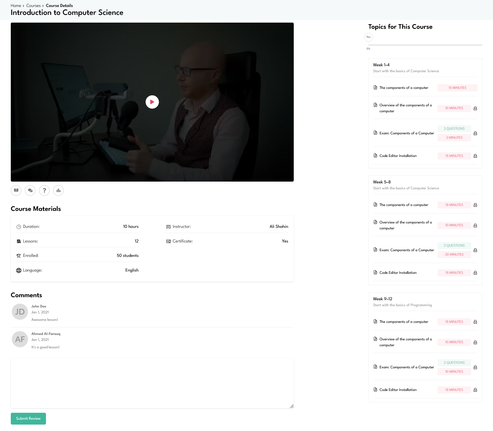
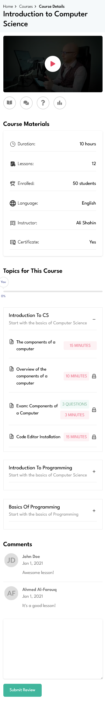

# **📘 Course App – Interactive Learning Experience**

> **Course App** is a modern web platform built to deliver engaging online courses with features like video lessons, comments, Q&A, leaderboard, and progress tracking.

---

## **📸 Screenshots**

| **Lesson View**                             | **Mobile View**                           |
| ------------------------------------------- | ------------------------------------------------ |
|      |  |

---

## **🚀 Live Demo**

🔗 **[Visit Course App Live](https://courses-app-eight.vercel.app/courses/1/1)**

---

## **🛠️ Tech Stack**

### **Frontend**

- **Vite + React 18+**
- **TypeScript**
- **Tailwind CSS** (Utility-First CSS)
- **React Icons**
- **Swiper.js** (for interactive sliders)
- **React Context API** (for global state)

---

## **📚 Features**

- ✅ **Video Lessons**
- ✅ **Interactive Comments & Q&A Modal**
- ✅ **Persistent Progress Tracking (localStorage)**
- ✅ **Custom Leaderboard Modal**
- ✅ **Theater Mode + Fullscreen Support**
- ✅ **Custom Timer Component for Exams**
- ✅ **Custom Checkbox, Modal, and UI Components**
- ✅ **Swiper Slides with Navigation Preview**
- ✅ **Mobile-Responsive Design**

---

## **🖥️ Installation Guide**

### 🔹 Prerequisites

- [Node.js](https://nodejs.org/)
- [Git](https://git-scm.com/)

### 🔹 Clone & Setup

```bash
git clone https://github.com/your-username/course-app.git
cd course-app
cp .env.example .env
